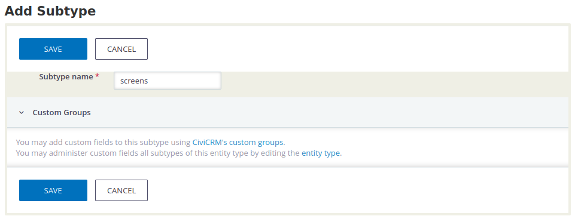
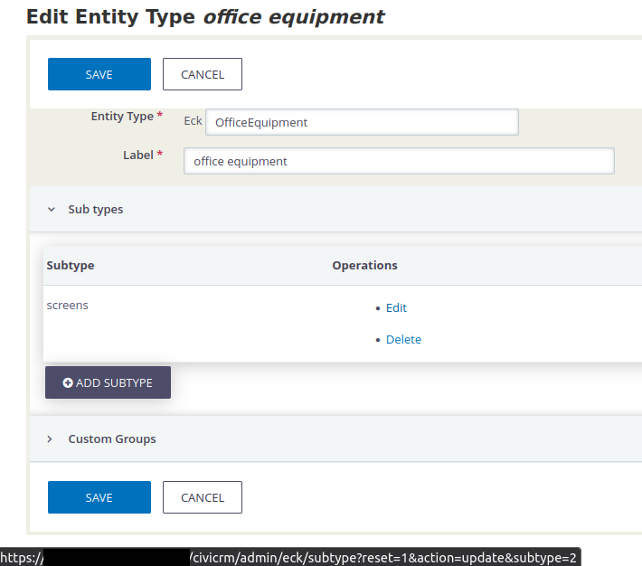

Before you add new entities, plan a structure for your needs. The best way to
show this is with a concrete Example: an organisation wants to manage their
office equipment with CiviCRM. So before we create individual items, we need to
create a common category. These are called **ECK Entity Types**. In our example,
this would be *Office Equipment*. For this we can in turn create **Subtypes**
for further categorizing items. We will take as an example computer screens that
are used in the organisation. This gives us the possibility later on to give the
individual "things" we create exactly the right properties.

## Adding entity types

After installing ECK, you will find the following entry in the administration
console under **Customize Data and Screens** -
**ECK EntityTypes**, and also in the CiviCRM navigation menu. There you can
create a new category with the **Add Entity Type** button. Enter the system name
in the **Entity Type** field (following the PascalCase naming scheme) and a name
that is easy for users to read or a translation in the **Label** field.

## Adding subtypes

Before we can continue here, we must save once so that the new entity type is
created. From the overview edit the new type to create a new sub category
with **Add Subtype**. Here you will also find a hint where new fields can be
created later especially for this subtype.

!!!note
    Each subtype has an internal ID which (for now) will be needed for creating
    actual entities of a specific subtype. This ID is contained within the URL
    for editing the subtype. Hovering your mouse pointer over the **Edit** link
    on the **Edit Entity Type office equipment** form inside the **Subtype**
    fieldset, you should be able to see the URL in your browser's status bar
    (usually at the bottom of the screen). The ID (an integer) can be found
    after `subtype=`.
    
    

## Adding custom fields

Next, let's create means for adding *Custom Data* to entities of the entity
type. This can be done using CiviCRM's Custom Fields, as for Core entities like
Contacts and Contributions. First, as usual, create a new set of fields in the
Administration Console
**Add Set of Custom Fields**, for our example with a name like
*Office Equipment Data*. As **Used For** select the label of our ECK entity type
and **Any** for the whole equipment, regardless of subtypes. As a field, perhaps
something like *Number of*. And repeat the process to create special fields for
our computer screens, with something like *Size*,
*Connections*, *Condition*, etc.
