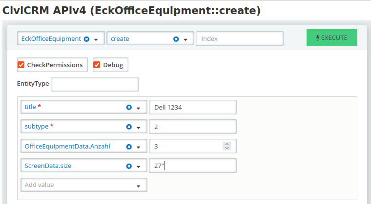

## Creating entities

!!!Note
    In a later version, adding new entities will be possible via the *List
    Entities* page. At the moment we use the API Explorer v4 for this.

In API Explorer v4 we can create a new entity by selecting the API entity
*EckOfficeEquipment* and the API action *create*. Should the entity be of a
specific subtype (e.g. *Computer Screens*), add the *subtype* parameter and
enter the corresponding ID (see [Configuration](configuration.md#adding-subtypes) how to find it). Hit *Execute* for
creating the entity.



Something like the following should now be issued as a response:
```json
{
  "id": 1,
  "title": "Dell 1234",
  "subtype": 2
}
```

## Listing entities

We now find our created entity back in the GUI on the *List entities* page which
can be accessed either via the corresponding link on the administration page for
the entity type, or in the CiviCRM navigation menu in the *Custom Entities* section.

## Viewing entities

If you click the entity label in the *Title* column, you will see all the
details of the entity, including its label, subtype and all custom field values.
